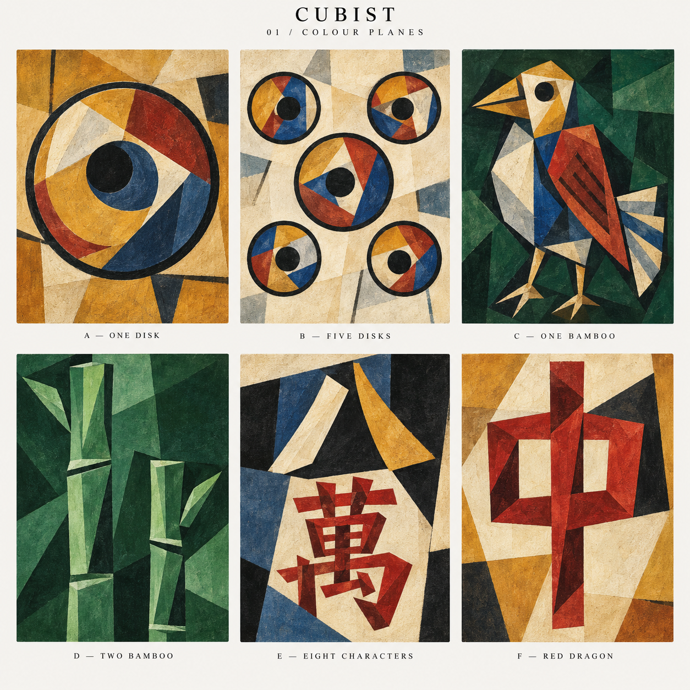
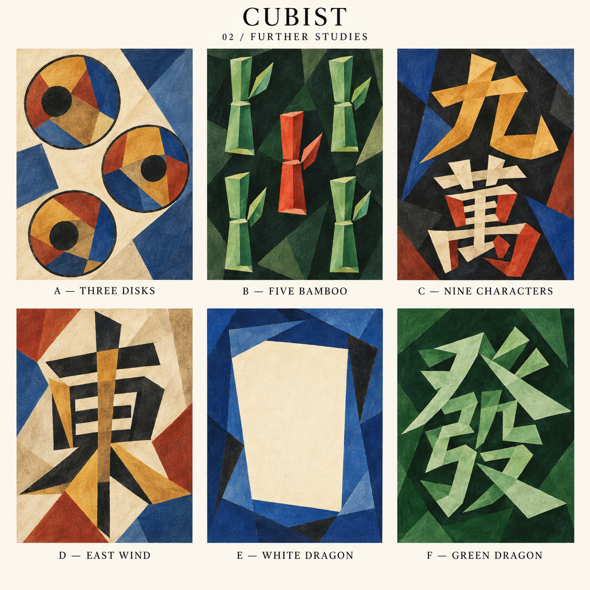

# Cubist mahjong tile set

**Set name:** Cubist  
**Set ID:** `cubist`  
**Stage:** five approved faces from study 02; remaining faces in development

**Created:** 8 September 2026

## Colour Planes

The first direction uses angular overlapping planes, displaced contours, dark line fragments and restrained painted-paper texture. Ochre, parchment, oxblood, dusty cobalt and forest green give the collection its palette. Each face is a small Cubist composition with a strong primary symbol.

These six first-sheet examples establish the direction. They remain candidates; the first production faces come from study 02 below.

| Candidate | Tile ID | Tile | Concept |
| --- | --- | --- | --- |
| A | `1p` | One disk | One large off-centre coin with faceted ochre, blue and red planes inside a closed circular contour. |
| B | `5p` | Five disks | Five separate disks in a quincunx; the centre is larger, and each disk has its own fractured interior. |
| C | `1s` | One bamboo | A single angular bird with an ochre beak, blue body, rust-red wing and broad tail against forest green. |
| D | `2s` | Two bamboo | Two staggered architectural stalks, with the entire face in shades of green. |
| E | `8m` | Eight characters | Two open strokes form 八 above a red angular 萬, interlocking with charcoal and blue planes. |
| F | `7z` | Red dragon | An oversized red 中 with an asymmetric enclosure, two open counters and a continuous central stem. |

**Suggested anchors:** C and F establish the character of the set; B establishes how countable disk tiles can share it.

## Further Studies — approved A–E

Carl selected **all but F** from this second sheet and requested deployment to GitHub. The selection applies to A–E on this sheet; the first sheet remains unapproved.

| Candidate | Tile ID | Tile | Status |
| --- | --- | --- | --- |
| A | `3p` | Three disks | Approved and exported |
| B | `5s` | Five bamboo | Approved and exported |
| C | `9m` | Nine characters | Approved and exported |
| D | `1z` | East wind | Approved and exported |
| E | `5z` | White dragon | Approved and exported |
| F | `6z` | Green dragon | Rejected; study only |

Choose **Options → Tile face → Cubist** in the game. The other 29 tile identities use Classic artwork, including the rejected green dragon. The white dragon retains its approved blank ivory centre, with the normal red dora ring and foil sheen.

The five exports preserve the exact approved source pixels. The crops exclude the sheet heading, labels and gutters. Production SVGs fit the artwork to the existing full-bleed 3:4 face with 26-unit corners and 1% bleed. The three disks remain countable even where their outer contours meet the source edge; the five bamboo stalks remain separate and complete.

- [Study 02 prompt](prompts/02-further-studies.txt)
- [Approved exports and mixed-hand preview](../../../web/public/tiles/cubist/preview.html)
- [Source hash, crop rectangles and export hashes](../../../web/public/tiles/cubist/manifest.json)

Reproduce with `node web/scripts/export-cubist-tiles.mjs`.

## Continuity with the Matisse set

The current Matisse artwork and design notes were inspected on `main` at `17a6cae320eb302da6adcd8bd8a899a103fbd278`. The reference faces included `Pin5`, `Sou1`, `Sou2`, `Man8` and `Chun`.

Carry forward the existing project's full-bleed faces, large readable motifs, accurate suit counts and Chinese glyphs. Production faces should use the shared portrait 3:4 presentation without a painted rim, bevel or shadow. For All Green, keep every part of `2s`, `3s`, `4s`, `6s`, `8s` and `6z` within the green palette.

The study sheet is a presentation image, not a spritesheet or production asset. Labels and gutters sit outside the artwork. For selected candidates, prepare individual faces, check complete motifs and glyphs, and inspect their readability in the existing small and rotated tile views before export. In particular, the two-bamboo composition currently extends to the lower edge; decide the final crop when preparing its standalone face.

## Source

- [Original concept sheet](studies/01-colour-planes.png), 1254 × 1254 PNG.
- [Generation prompt](prompts/01-colour-planes.txt).
- Created with ChatGPT's built-in image generation tool. This is new artwork informed by the repository's design constraints; the existing tile images were inspected as references and were not edited.
- Visual review: six labelled candidates; one disk in A, five separate disks in B, one bird in C, two stalks in D, recognisable 八 and 萬 in E, and a continuous 中 stem with two openings in F. Small-size gameplay readability remains to be checked on individual approved faces.
