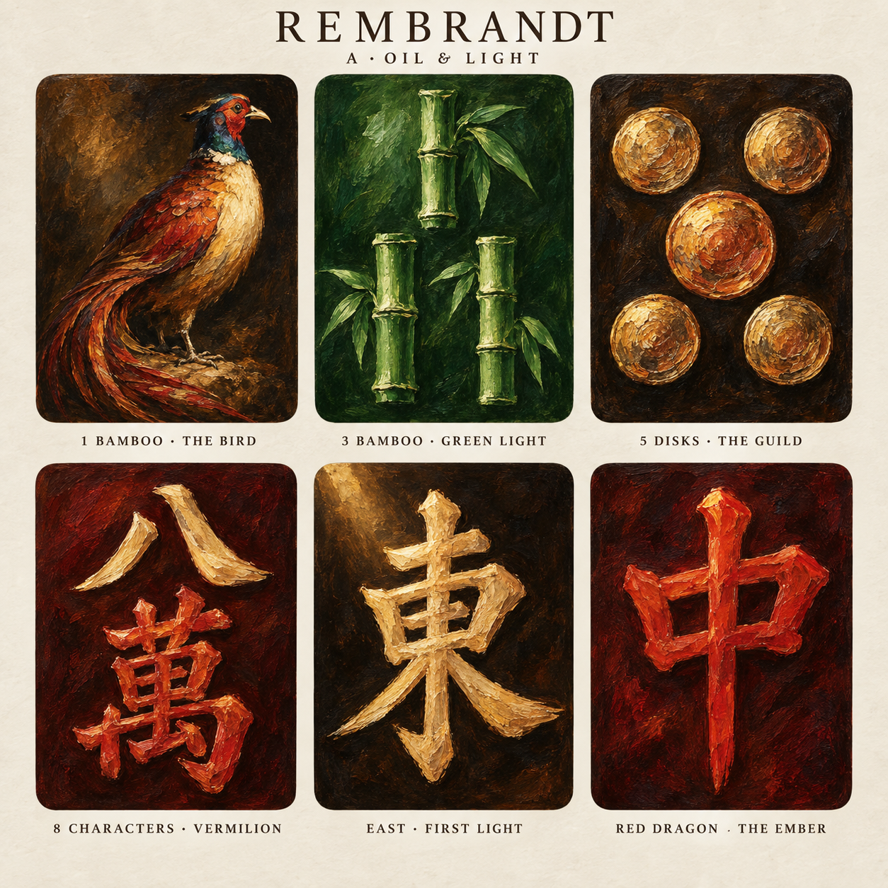
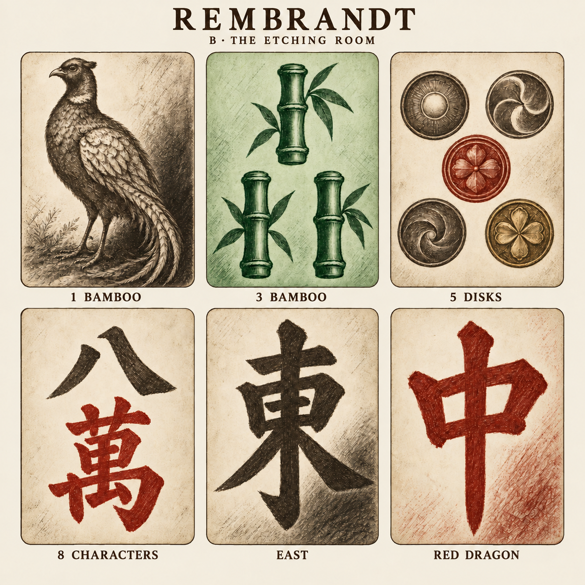

# Rembrandt mahjong tile set

Initial concepts for **Rembrandt**, a new tile collection alongside Classic and Matisse. Created for Carl on 8 September 2026. The two directions below explore the same six tile identities so their treatment can be compared directly.

These are concept studies. Neither direction is selected or approved, and the set is not yet available in the game's Tile face menu.

## A — Oil & Light

Rich shadows, warm directional light, broad loaded brushstrokes and bright paint highlights. The bird becomes a miniature portrait, disks suggest illuminated metal, and the large characters emerge from burgundy or umber fields. Bamboo keeps its green palette.

This is the recommended direction for the collection. Keep the major silhouettes brighter than their backgrounds as the set expands; the oil texture should enrich those silhouettes without breaking them up at hand size.

## B — The Etching Room

Expressive drypoint and etched hatching on a light paper ground, with sepia, rust-red and green ink. This offers a quieter, lighter alternative. The green bamboo face uses celadon paper and deep green marks throughout.

## Example identities

Both boards use the same order, from left to right across the first row, then the second.

| Position | Tile ID | Export name | Example | Design idea |
| --- | --- | --- | --- | --- |
| Top left | `1s` | `Sou1` | 1 bamboo — The Bird | A single lively bird, with a clear head, chest, wing and curved tail. |
| Top centre | `3s` | `Sou3` | 3 bamboo — Green Light | Exactly three separate jointed stalk motifs, one above two, entirely in green. |
| Top right | `5p` | `Pin5` | 5 disks — The Guild | Exactly five separate disks in a quincunx, with a distinctive centre. |
| Bottom left | `8m` | `Man8` | 8 characters — Vermilion | Recognisable `八` and traditional `萬`, given contrasting weight and colour. |
| Bottom centre | `1z` | `Ton` | East — First Light | A dominant `東`, shaped with strong light and shadow. |
| Bottom right | `7z` | `Chun` | Red dragon — The Ember | A large vermilion `中`, keeping its long central stroke and two open counters. |

## Rules for the full collection

- Keep all 34 standard tile identities. Suited motifs must remain countable; character and wind strokes must remain recognisable.
- Use the shared 3:4 face and 300 × 400 canvas, with 26-unit rounded corners and the existing 1% bleed. Colour or paper reaches all four face edges. Keep labels, presentation backgrounds, physical bevels and inset ivory rims out of exported artwork.
- Keep `2s`, `3s`, `4s`, `6s`, `8s` and `6z` entirely within shades of green, including highlights and backgrounds, following the existing All Green design constraint. For the etching direction, this means green ink on a light green ground.
- Keep enough colour and tonal separation between suits. Avoid making every tile the same brown-and-gold field.
- Treat the ordinary fives and red fives consistently with the app's existing red-five handling. The studies depict ordinary fives.
- Develop a quiet white dragon and a precisely aligned silver dora state as a pair. Keep the common face-down tile back.
- Judge individual faces at the actual hand and discard sizes before approval. The multi-tile boards are design references, not production exports.

## Next production pass

After a direction is selected, refine each face as a separate full-resolution flat artwork. Expand all three suits, the four winds and three dragons, then export from the selected source pixels using the same face presentation as Matisse. Add the Rembrandt option only when the intended playable collection and white-dragon reveal are ready.

The [manifest](manifest.json) reserves all 34 identities and records the concept status of the six studied tiles. The [prompt history](prompts.json) contains the original generation and refinement instructions. Artwork was produced with the built-in image-generation tool; the two source boards are preserved as PNG files.
