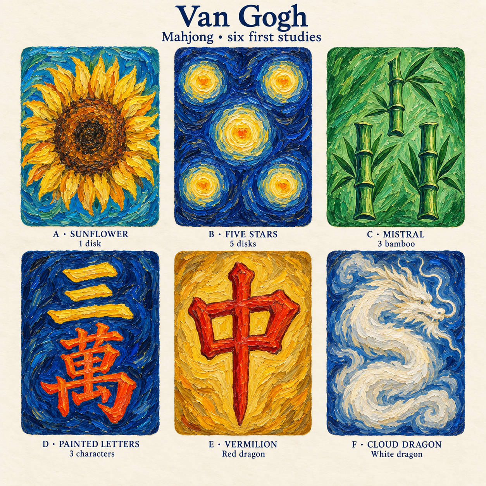
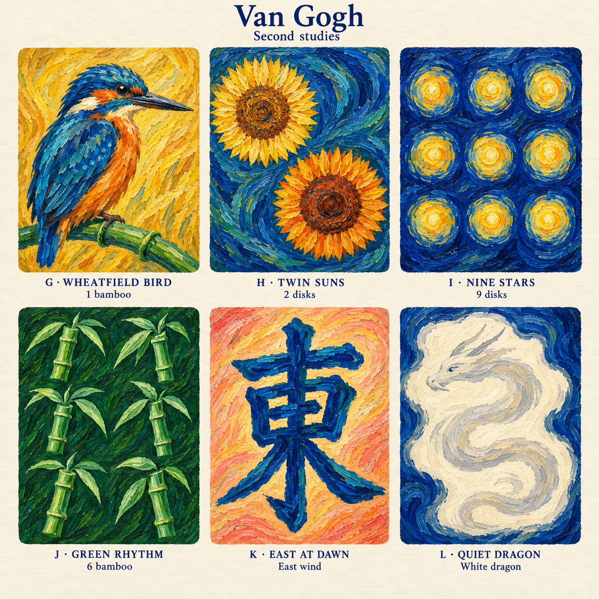

# Van Gogh

First concepts for a new mahjong tile set, developed on 8 September 2026 after reviewing the existing Matisse artwork and its export conventions.

Carl approved all except K and requested deployment. **Van Gogh is now a selectable set** with ten distinct approved faces: A–E, G–J and L. The later L is the active white dragon; F remains an earlier alternative. East wind K is excluded. The remaining 24 tile identities use Classic artwork. See the [playable exports and preview](../../../web/public/tiles/van-gogh/README.md).

## First six examples

| Study | Tile | Direction |
| --- | --- | --- |
| A — Sunflower | 1 disk (`1p`, `Pin1`) | One large golden sunflower head on turquoise and cobalt. The flower is the disk: no stem, vase or additional flowers. |
| B — Five Stars | 5 disks (`5p`, `Pin5`) | Five round yellow stars in a clear quincunx on a swirling ultramarine field. Dark gaps separate the disks. |
| C — Mistral | 3 bamboo (`3s`, `Sou3`) | Three jointed stalks in a one-above-two arrangement, with forceful green brushwork and pointed leaves. The entire face stays within the green family. |
| D — Painted Letters | 3 characters (`3m`, `Man3`) | Three golden strokes form 三 above vermilion 萬 on deep blue. Paint gives the characters their form. |
| E — Vermilion | Red dragon (`7z`, `Chun`) | A large red 中 on ochre, with two open counters and a strong central vertical. |
| F — Cloud Dragon | White dragon (`5z`, `Haku`) | A pale curling dragon in ivory cloud strokes, surrounded by expressive cobalt. |

## Second studies

| Study | Tile | Direction |
| --- | --- | --- |
| G — Wheatfield Bird | 1 bamboo (`1s`, `Sou1`) | A large cobalt-and-copper bird on green bamboo against a golden field. |
| H — Twin Suns | 2 disks (`2p`, `Pin2`) | Two distinct sunflower heads on a flowing teal and cobalt field. |
| I — Nine Stars | 9 disks (`9p`, `Pin9`) | Nine luminous round star disks in a clear three-by-three arrangement. |
| J — Green Rhythm | 6 bamboo (`6s`, `Sou6`) | Six separate jointed stalk motifs, in two columns of three, with green hues throughout. |
| K — East at Dawn | East wind (`1z`, `Ton`) | Large cobalt 東 against peach, coral and golden brushstrokes. |
| L — Quiet Dragon | White dragon (`5z`, `Haku`) | A simpler pale dragon with a broad curling body and fewer details within an ivory field. Alternative to F. |

The second sheet was generated after Carl asked to continue and retry image generation. **G and H are the strongest new directions.** I keeps nine clearly separated disks; J keeps six clearly separated bamboo motifs. L removes much of F's filigree and gives the white dragon a simpler silhouette. K should receive a final glyph-structure check, and H's flower petals need more clearance at the edges, when these concepts become individual faces.

The two sheets contain 12 studies covering 11 distinct tile types, including two white-dragon alternatives. Ten distinct faces are now approved and exported. The full Van Gogh artwork collection remains in progress, and East wind is being redesigned. The normal dora foil shines over L's own painted dragon without substituting another set's dragon.

## Design language

Use Van Gogh's rhythmic oil strokes, vivid warm/cool contrasts and strongly drawn contours to build the actual tile symbols. Keep motifs large enough to survive the game's small display sizes. Vary the palette and composition across the set while maintaining a shared painted language.

The Matisse set establishes the practical constraints: full-face colour, a 3:4 portrait face, no painted rim or physical bevel, legible tile identities and countable suit motifs. Keep those constraints. Retain traditional glyphs for characters and winds and the bird convention for 1 bamboo. The bamboo tiles eligible for All Green (`2s`, `3s`, `4s`, `6s`, `8s`) and green dragon (`6z`) should use green hues throughout their artwork, following the existing set's design convention.

## First review

- **A and B are the strongest anchors.** The sunflower is a distinctive single disk; the five stars have an immediately readable count. Explore round sunflower heads and star disks across the disk suit without adding background stars that could confuse the count.
- **C has the right structure.** Keep the three stalks separate. In a final face, simplify the busy surrounding leaves and preserve unmistakable green highlights.
- **D and E read clearly at study scale.** Keep the open spaces inside the glyphs when refining the brushwork. Check every traditional character against the tile identity before approving a production face.
- **F needs the most simplification for play.** Reduce whiskers and fine strokes, broaden the light central area and make the dragon quieter. A later silver dora state should use exactly the same composition and crop as the base face.

The second sheet explores the bird, further bamboo rhythms and the dawn wind palette. Further ideas include the remaining wind glyphs on distinct daylight, sunset and night palettes, and a green 發 formed from layered malachite and mint strokes. These remaining directions are not yet generated examples.

## Source and next production step

Both the [first concept sheet](studies/01-van-gogh-concepts.png) and [second concept sheet](studies/02-van-gogh-concepts.png) are unmodified image-generation outputs. They contain captions and gutters outside the faces and are not production atlases. The [manifest](manifest.json) records the study identities, source dimensions and hashes. The [first prompt](prompt.md) and [second prompt](prompt-02.md) preserve the briefs used with ChatGPT's built-in image generation tool.

The deployed faces preserve the exact approved source pixels in lossless rectangular crops. Captions and presentation gutters are excluded. Their SVG wrappers follow the existing 300 × 400 canvas, 26-unit corner radius and 1% bleed conventions. The [export script](../../../web/scripts/export-van-gogh-tiles.mjs) reproduces all ten faces and the preview. Continue the remaining artwork through all 34 tile types as further designs are selected.

Reference: [Matisse set and export conventions](../../../web/public/tiles/matisse/README.md).
