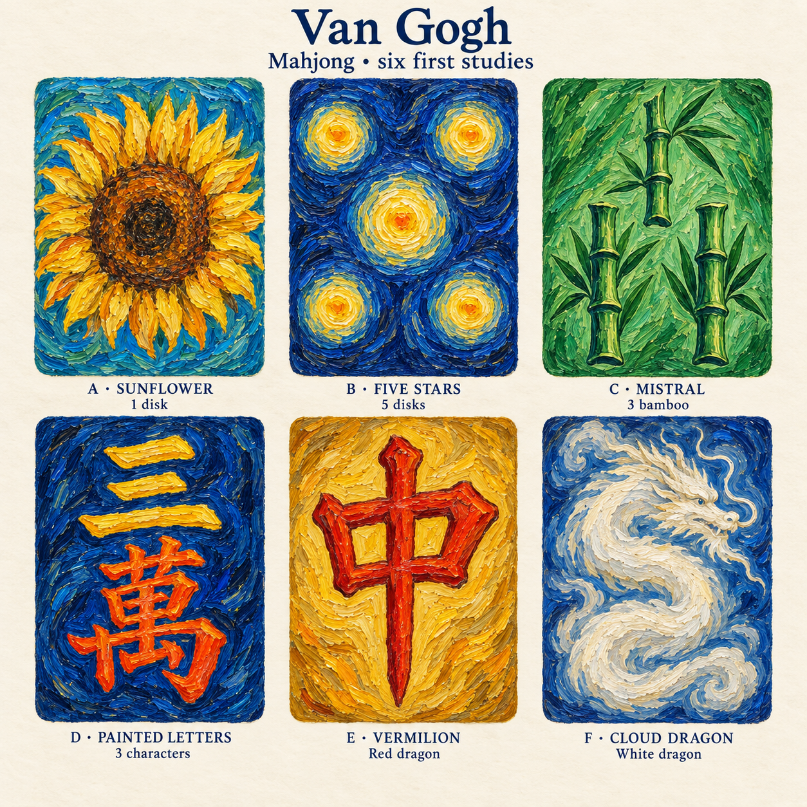
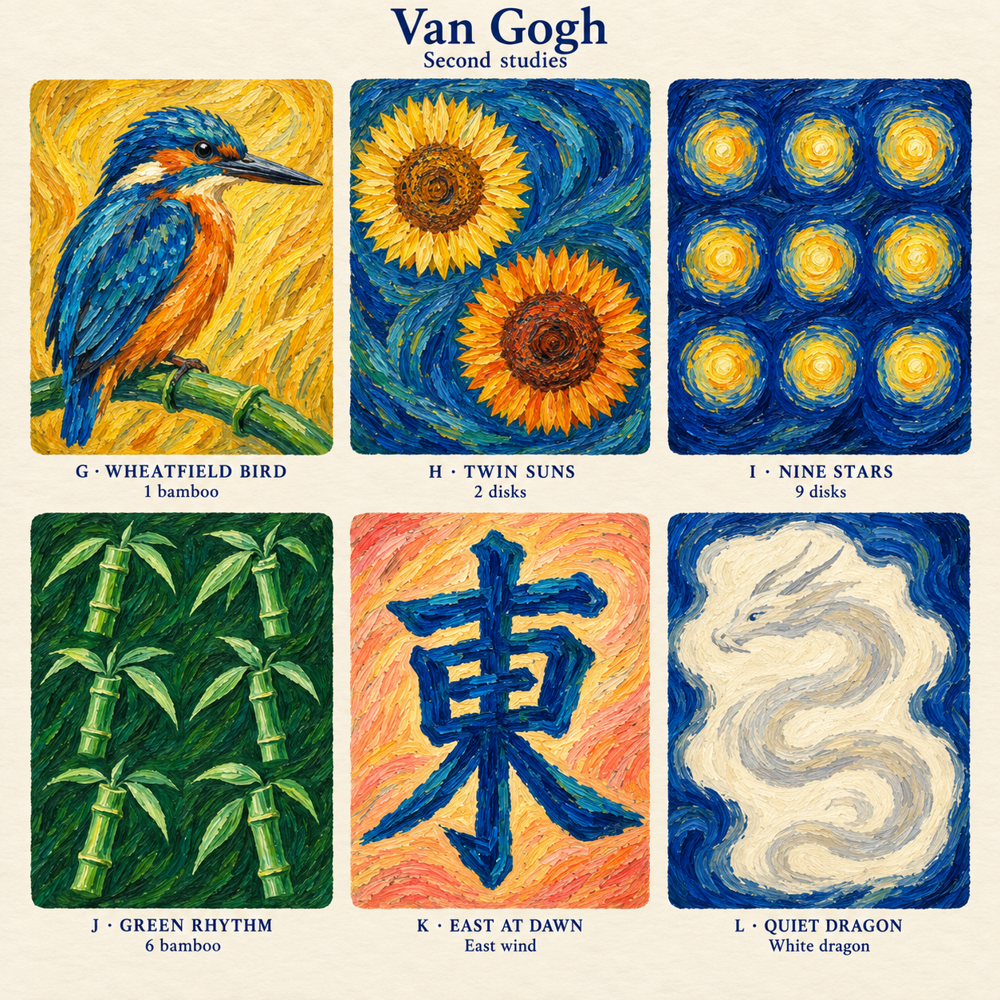
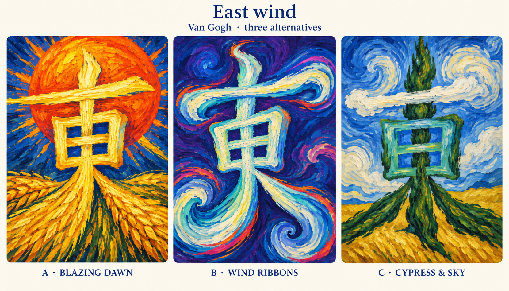
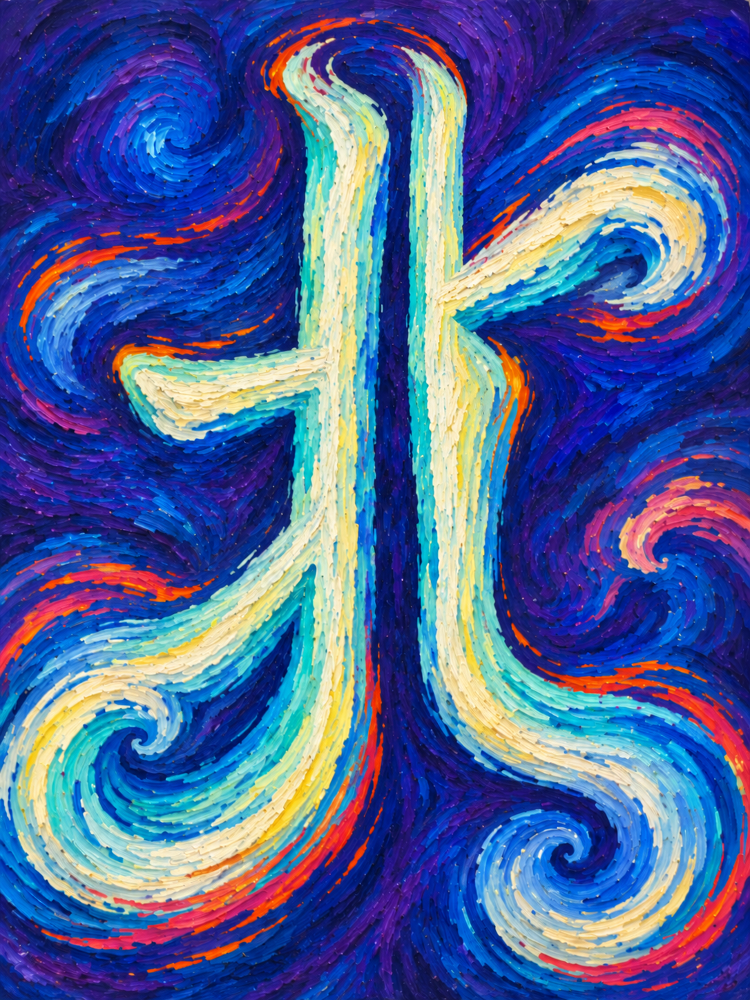
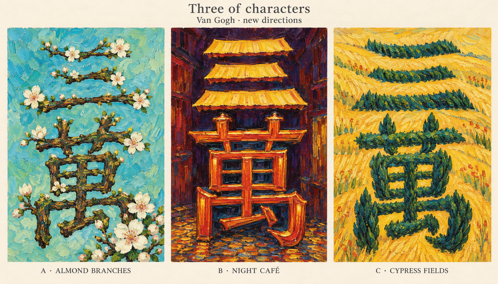

# Van Gogh

**Current 9 disks:** The Potter’s Table C is active, replacing Nine Stars I. This corrects the misunderstood restoration: Carl explicitly chose the pottery painting. The approved SVG is kept byte-for-byte as its study, the playable face differs from it only in its fit (see [Proportions](#proportions-cropped-not-stretched)), and Nine Stars remains preserved in the design archive. 8 disks and all other tiles are unchanged. Earlier sections below describe the design history.

**Current set:** 27 painted faces, and 7 tiles whose names the game writes out until they are painted; all nine bamboo identities are covered. The Provençal Kitchen B is active for 6 disks, Starry Olive Grove for 8 characters, Four Oranges A for 4 disks, Irises at Dusk C for 7 characters, Lemon Terrace for 6 characters, The Red Vineyard for 5 characters, and The Potter’s Table C for 9 disks. The history below retains earlier milestone counts.

First concepts for a new mahjong tile set, developed on 8 September 2026 after reviewing the existing Matisse artwork and its export conventions.

Carl approved all except K and requested deployment. **Van Gogh is a selectable set with nineteen distinct faces**: A–B, E, G–J and L, plus Copper Sunset for 5 bamboo, Bamboo Raft for 8 bamboo, Seven with Irises C for 7 bamboo, green Moonlit Four C for 4 bamboo, green Triple Shoots A for 3 bamboo, green Garden Rhythm B for 2 bamboo, Almond Branches (Characters A), Night Café (Characters B), Cypress Fields (Characters C), Blazing Dawn (East A) and Wind Ribbons (North B). Almond Branches replaces D for 3 of characters; Night Café and Cypress Fields are the approved adaptations for 2 and 4 of characters. The later L is the active white dragon; F remains an earlier alternative. East wind K is excluded. The remaining 15 tile identities use Classic artwork. See the [playable exports and preview](../../../web/public/tiles/van-gogh/README.md).

## First six examples

| Study | Tile | Direction |
| --- | --- | --- |
| A — Sunflower | 1 disk (`1p`, `Pin1`) | One large golden sunflower head on turquoise and cobalt. The flower is the disk: no stem, vase or additional flowers. |
| B — Five Stars | 5 disks (`5p`, `Pin5`) | Five round yellow stars in a clear quincunx on a swirling ultramarine field. Dark gaps separate the disks. |
| C — Mistral | 3 bamboo (`3s`, `Sou3`) | Three jointed stalks in a one-above-two arrangement, with forceful green brushwork and pointed leaves. The entire face stays within the green family. |
| D — Painted Letters | 3 characters (`3m`, `Man3`) | Three golden strokes form 三 above vermilion 萬 on deep blue. Paint gives the characters their form. |
| E — Vermilion | Red dragon (`7z`, `Chun`) | A large red 中 on ochre, with two open counters and a strong central vertical. |
| F — Cloud Dragon | White dragon (`5z`, `Haku`) | A pale curling dragon in ivory cloud strokes, surrounded by expressive cobalt. |

## Second studies

| Study | Tile | Direction |
| --- | --- | --- |
| G — Wheatfield Bird | 1 bamboo (`1s`, `Sou1`) | A large cobalt-and-copper bird on green bamboo against a golden field. |
| H — Twin Suns | 2 disks (`2p`, `Pin2`) | Two distinct sunflower heads on a flowing teal and cobalt field. |
| I — Nine Stars | 9 disks (`9p`, `Pin9`) | Nine luminous round star disks in a clear three-by-three arrangement. |
| J — Green Rhythm | 6 bamboo (`6s`, `Sou6`) | Six separate jointed stalk motifs, in two columns of three, with green hues throughout. |
| K — East at Dawn | East wind (`1z`, `Ton`) | Large cobalt 東 against peach, coral and golden brushstrokes. |
| L — Quiet Dragon | White dragon (`5z`, `Haku`) | A simpler pale dragon with a broad curling body and fewer details within an ivory field. Alternative to F. |

The second sheet was generated after Carl asked to continue and retry image generation. **G and H are the strongest new directions.** I keeps nine clearly separated disks; J keeps six clearly separated bamboo motifs. L removes much of F's filigree and gives the white dragon a simpler silhouette. K should receive a final glyph-structure check, and H's flower petals need more clearance at the edges, when these concepts become individual faces.

The first two sheets contain 12 studies covering 11 distinct tile types, including two white-dragon alternatives. Eight of those faces remain active after the Almond Branches replacement for 3 of characters and the Triple Shoots replacement for 3 bamboo. The normal dora foil shines over L's own painted dragon without substituting another set's dragon.

## Selected East wind

On 12 September 2026, Carl selected **A — Blazing Dawn** for East and requested deployment. The playable `Ton` (`1z`) is cropped directly from the left-hand A, preserving its golden sunlight and wheat character against the orange sun and cobalt sky. The [prompt record](prompt-03.md) preserves the original generation and correction briefs. B and C remain alternatives; K remains rejected.

## Selected North wind

Carl selected A for East and commissioned North in B's Wind Ribbons style: ivory and turquoise 北 on violet and ultramarine. The corrected North design extends the right upright into the upper third, with its diagonal joining below the top. Both halves remain separated by a dark gap, with broad curls below.

Carl approved deployment, then supplied the [original shared image](https://chatgpt.com/s/m_6aa570cca934819188878ae3ac92bde4) to recover the exact artwork after its temporary working copy was lost. The original 1086 × 1448 PNG is now committed in this repository. The playable `Pei` (`4z`, North B) uses its entire canvas without repainting. The [source and prompt record](prompt-04.md) preserves the image hash and correction brief.

## Selected 3 of characters

On 13 September 2026, Carl selected **A — Almond Branches** for 3 of characters and requested deployment. The playable `Man3` (`3m`, Characters A) is cropped directly from the approved left panel at `[25, 93, 523, 782]`. Flowering branches form 三萬 against an aquamarine field. The [complete prompt](prompt-06.md) and original sheet are preserved; the source image SHA-256 is `a0d0c325a5f63f6121555e099afcbba65cfaeb2941aee3962572b371282bfdd7`.

Carl also requested recreations of **B — Night Café** for 2 of characters (`二萬`) and **C — Cypress Fields** for 4 of characters (`四萬`), and approved their deployment. Both full-canvas adaptations are preserved as separate source images and now have playable exports: [Night Café 2](studies/07-two-characters-night-cafe.png) and [Cypress Fields 4](studies/08-four-characters-cypress-fields.png). The [deployment record](characters-two-four.md) describes the exact-source checks. The earlier Painted Letters D remains preserved in the first study sheet.

## Design language

Use Van Gogh's rhythmic oil strokes, vivid warm/cool contrasts and strongly drawn contours to build the actual tile symbols. Keep motifs large enough to survive the game's small display sizes. Vary the palette and composition across the set while maintaining a shared painted language.

The Matisse set establishes the practical constraints: full-face colour, a 3:4 portrait face, no painted rim or physical bevel, legible tile identities and countable suit motifs. Keep those constraints. Retain traditional glyphs for characters and winds and the bird convention for 1 bamboo. The bamboo tiles eligible for All Green (`2s`, `3s`, `4s`, `6s`, `8s`) and green dragon (`6z`) should use green hues throughout their artwork, following the existing set's design convention.

## First review

- **A and B are the strongest anchors.** The sunflower is a distinctive single disk; the five stars have an immediately readable count. Explore round sunflower heads and star disks across the disk suit without adding background stars that could confuse the count.
- **C has the right structure.** Keep the three stalks separate. In a final face, simplify the busy surrounding leaves and preserve unmistakable green highlights.
- **D and E read clearly at study scale.** Keep the open spaces inside the glyphs when refining the brushwork. Check every traditional character against the tile identity before approving a production face.
- **F needs the most simplification for play.** Reduce whiskers and fine strokes, broaden the light central area and make the dragon quieter. A later silver dora state should use exactly the same composition and crop as the base face.

The second sheet explores the bird, further bamboo rhythms and the dawn wind palette. Further ideas include the remaining wind glyphs on distinct daylight, sunset and night palettes, and a green 發 formed from layered malachite and mint strokes. These remaining directions are not yet generated examples.

## Source and next production step

Both the [first concept sheet](studies/01-van-gogh-concepts.png) and [second concept sheet](studies/02-van-gogh-concepts.png) are unmodified image-generation outputs. They contain captions and gutters outside the faces and are not production atlases. The [manifest](manifest.json) records the study identities, source dimensions and hashes. The [first prompt](prompt.md) and [second prompt](prompt-02.md) preserve the briefs used with ChatGPT's built-in image generation tool.

The earlier deployed faces preserve the approved source pixels in lossless rectangular crops or full-canvas PNG copies; the green 2s and 3s replacements use documented high-quality WebP game exports. Captions and presentation gutters are excluded. Their SVG wrappers follow the existing 300 × 400 canvas, 26-unit corner radius and 1% bleed conventions. The [export script](../../../web/scripts/export-van-gogh-tiles.mjs) reproduces all nineteen faces and the preview. Use `--only=2m,4m` to export the two new character faces without re-encoding any existing artwork. Continue the remaining artwork through all 34 tile types as further designs are selected.

Reference: [Matisse set and export conventions](../../../web/public/tiles/matisse/README.md).

## Garden Rhythm: green 2 bamboo

The approved revised green B is active for `2s` (`Sou2`). The two bamboo stalks, garden canal and bridge are unchanged in composition. The deployed 300 by 400 source is a high-quality WebP crop, with source checksum, original-board checksum and crop coordinates recorded in `docs/design/van-gogh/two-bamboo-green.json`. Earlier tile artwork is unchanged. Run `node web/scripts/export-van-gogh-tiles.mjs --only=2s` to regenerate this face. That addition brought the set to 15 painted faces and 19 Classic fallbacks.

## Triple Shoots: green 3 bamboo replacement

The approved greener **A — Triple Shoots** replaces the original C artwork for `3s` (`Sou3`), using the existing `approved/Sou3.png` and `approved/Sou3.svg` paths. Exactly three bamboo stalks form the tile identity. No other playable tile is changed. Original C remains in the first study sheet and Git history.

The source is a 300 × 400, quality-95 WebP export of the selected panel, not a lossless full-resolution original. The original board checksum, 439 × 673 crop coordinates and optimized-source checksum are recorded in `docs/design/van-gogh/three-bamboo-green.json`. Run `node web/scripts/export-van-gogh-tiles.mjs --only=3s` to reproduce this replacement. That replacement retained 15 painted faces and 19 Classic fallbacks.

## Moonlit Four: green 4 bamboo

The approved greener **C — Moonlit Four** is active for `4s` (`Sou4`). Four distinct bamboo stalks stand against the emerald and teal night sky. The committed source is a 300 × 400, quality-95 WebP game export of the selected right panel, not a lossless full-resolution original. The original board checksum and 438 × 671 crop coordinates are recorded in `docs/design/van-gogh/four-bamboo-green.json`. The original review board and full-resolution selected crop were also preserved in the downloadable approval archive.

Run `node web/scripts/export-van-gogh-tiles.mjs --only=4s` to reproduce the playable PNG and SVG. All previously approved artwork is unchanged, including 2 and 3 bamboo. That addition brought the set to 16 painted faces and 18 Classic fallbacks.

## Seven with Irises: 7 bamboo

On 29 September 2026 Carl selected **C — Seven with Irises** from the 7 bamboo study board and requested deployment. It is active for `7s` (`Sou7`). The six green stalks and central reddish-brown stalk form seven distinct bamboo motifs, with blue-purple irises, golden fields and a small cottage. This is the selected C artwork, not a repaint.

The study-sheet heading, gutters and caption were removed with the exact crop `[1043, 115, 479, 793]` from the 1536 × 1024 board. The entire cropped composition was resized to the shared 300 × 400 game canvas and saved as quality-95 WebP, following the newer bamboo source convention. This committed source is a web-optimized export, not the full-resolution lossless original. The original board, full-resolution crop and production-source hashes are recorded in `docs/design/van-gogh/seven-bamboo-irises.json`.

Run `node web/scripts/export-van-gogh-tiles.mjs --only=7s` to reproduce the playable PNG, self-contained SVG, registration, manifest and preview. All sixteen previously approved tile images remain byte-for-byte unchanged. The set now has **17 painted faces and 17 Classic fallbacks**.

## Copper Sunset — 5 bamboo

The approved **Copper Sunset** is active for `5s` / `Sou5`: four green bamboo stalks frame one tall reddish-brown central stalk. The earlier all-green concept is not used. The complete approved composition is retained, with no cropping, recolouring or repainting.

`studies/15-five-bamboo-copper-sunset.webp` is a 300×400, quality-95 WebP game export, following the recent bamboo convention. It is not a lossless full-resolution original. Source and original checksums, full-canvas coordinates and processing details are recorded in `docs/design/van-gogh/five-bamboo-copper.json`; the untouched original is preserved in `van-gogh-five-bamboo-copper-original.zip` supplied in chat.

The set now contains **19 painted faces and 15 Classic fallbacks**. All 18 previous painted faces and their source artwork are unchanged. Regenerate this addition alone with `node web/scripts/export-van-gogh-tiles.mjs --only=5s`.

## Moonlit Bamboo Wind Chime — 9 bamboo

Carl selected the **first option, Wind Chime A**, for `9s` / `Sou9` and explicitly requested deployment. Nine hanging bamboo tubes are arranged in three groups of three against a swirling cobalt sky and golden moon. The support rail, copper-orange cords, foliage and village remain part of the exact approved painting. No repainting, recolouring or additional symbols were applied.

The source `docs/design/van-gogh/studies/16-nine-bamboo-wind-chime-a-approved.svg` and playable `web/public/tiles/van-gogh/approved/Sou9.svg` are byte-for-byte identical. They embed a proportional 300 × 400 quality-80 WebP export of the complete 1086 × 1448 portrait, with the shared rounded clipping and 1% bleed. This is a game-sized export, not the full-resolution original. Original, raster and SVG hashes are recorded in `docs/design/van-gogh/nine-bamboo-wind-chime.json`; the untouched original is preserved in `Van_Gogh_9_Bamboo_Wind_Chime_Approved.zip` supplied in chat.

Run `node web/scripts/export-van-gogh-tiles.mjs --only=9s` to reproduce the approved SVG, registration, manifest and preview without rewriting any other tile artwork.

This addition completes **all nine bamboo identities**. The set now has **20 painted faces and 14 Classic fallbacks**. All nineteen previously approved faces are unchanged.

## Three Café Lanterns B — 3 disks

Carl selected **B — Three Café Lanterns**, the middle panel of the three-disk concept board, for `3p` / `Pin3` and explicitly approved deployment. Three large golden lanterns hang above the night café. No repainting, recolouring, additional lanterns or symbol substitutions were applied.

The caption and presentation gutters are excluded with the exact `[503, 127, 442, 860]` crop from the original 1448 × 1086 board. Its entire composition is resized to the shared 300 × 400 game canvas using Lanczos and encoded as quality-90 WebP. This is an optimized game export, not a full-resolution or lossless copy. The untouched board and full-resolution selected PNG remain in the approval archive `van-gogh-3-disks-lanterns-prepared.zip` supplied in chat.

Source `docs/design/van-gogh/studies/17-three-disks-cafe-lanterns-b-approved.svg` and runtime `web/public/tiles/van-gogh/approved/Pin3.svg` are byte-for-byte identical. The embedded image uses the existing 26-unit rounded clipping and 1% bleed. Original-board, full-resolution-crop, WebP and SVG checksums are recorded in `docs/design/van-gogh/three-disks-lanterns.json`.

Run `node web/scripts/export-van-gogh-tiles.mjs --only=3p` to reproduce the game SVG, registration, manifest and preview without rewriting other artwork. This addition brings the set to **21 painted faces and 13 Classic fallbacks**. All twenty previously approved faces, including the complete bamboo suit, are unchanged.

## The Potter’s Table C — 9 disks replacement

Carl selected **C — The Potter’s Table** from the final artwork-only comparison and requested deployment. It replaces **I — Nine Stars** for `9p` / `Pin9`: nine blue-and-cream patterned plates in a three-by-three arrangement, with a wooden table, sunflower corners and swirling sky. This is the selected painting, not a regeneration.

Only the right-hand painting is cropped from the original composite at `[551, 56, 729, 1093]`; its inaccurate checklist and exterior margin are excluded. The complete selected crop is resized to a 300 × 400 quality-95 WebP and embedded in the standard SVG. This game export is not the lossless full-resolution original. Original, crop, embedded-raster and SVG checksums are recorded in `docs/design/van-gogh/nine-disks-potters-table-c.json`. The untouched original and lossless selected crop are preserved in the downloadable `van-gogh-nine-disks-potters-table-C-originals.zip` supplied in chat.

The original Nine Stars PNG and SVG are preserved byte-for-byte under `docs/design/van-gogh/superseded/nine-stars-Pin9.*`; the earlier study board is untouched. The stale Nine Stars PNG is removed from the playable directory after archiving. All other artwork is unchanged. This replacement retains **21 approved faces and 13 Classic fallbacks**. Regenerate only this face with `node web/scripts/export-van-gogh-tiles.mjs --only=9p`.

## The Red Vineyard A — 5 characters

Carl selected the **first option, The Red Vineyard**, for `5m` / `Man5` (`五萬`) and explicitly requested deployment. Copper-red vines and grape clusters form the characters over the golden vineyard landscape. The wheat and iris alternatives are not used. The entire approved composition and colours are retained without repainting or recolouring.

The complete 1086 × 1448 portrait is resized proportionally with Lanczos to a 300 × 400 quality-80 WebP, following the raft and green still-life export convention. The source `docs/design/van-gogh/studies/18-five-characters-vineyard-a-approved.svg` and game `web/public/tiles/van-gogh/approved/Man5.svg` are identical and use the standard rounded clip and 1% bleed. This is an optimized game export, not the full-resolution original PNG. Original, raster and SVG checksums are recorded in `docs/design/van-gogh/five-characters-vineyard.json`; the untouched original is preserved in `Van_Gogh_5_Characters_Vineyard_Approved.zip` supplied in chat.

Regenerate only this face with `node web/scripts/export-van-gogh-tiles.mjs --only=5m`. All 21 previously approved Van Gogh faces and all other sets remain unchanged. This addition brings the set to **22 painted faces and 12 Classic fallbacks**, with all nine bamboo faces preserved.

## Lemon Terrace — 6 characters (六萬)

Carl approved the latest red 六萬 calligraphy with lemons, cypresses, a lake and village for `6m` / `Man6`. This is the selected character painting, not the earlier sunflower study. No existing tile artwork is changed.

The complete 1295 × 1214 source is fitted to the shared 300 × 400 face using Lanczos and quality-80 WebP, embedded in a self-contained SVG with the usual rounded clip and 1% bleed. Fitting changes the aspect ratio; it is not a proportional resize. There is no selective cropping, repainting or colour edit. The unchanged full-resolution original is preserved in `Van_Gogh_6_Characters_Lemon_Terrace_Approved.zip` supplied in chat. See `docs/design/van-gogh/six-characters-lemon-terrace.json` for original, raster and SVG hashes.

The set now has **23 painted faces and 11 Classic fallbacks**. `node web/scripts/export-van-gogh-tiles.mjs --only=6m` copies the approved source to the game exactly without rewriting other faces. Regression tests cover hashes, registration, preloading, hidden tiles, the fourteen-tile preview hand and repeated selective export.

## Nine Stars — original 9 disks restored

The original nine luminous disks in a 3×3 arrangement are active again for `9p` / `Pin9`. Both the 380×471 PNG and its existing game SVG are byte-for-byte identical to the archived originals. The Potter’s Table C source, original provenance and archived runtime SVG are all retained. No other tile or tile coverage changes.

`docs/design/van-gogh/nine-stars-restored.json` records this decision and the hashes. Run `node web/scripts/export-van-gogh-tiles.mjs --only=9p` to reproduce the restored face without rewriting other artwork.

## Irises at Dusk C — 7 characters (七萬)

Carl selected the last of the three seven-characters designs: blue-violet irises form 七 above a golden 萬, against the painted sunset lake and village. This is the exact approved C painting, not the olive-grove or wheat alternatives. No repainting, recolouring, additional lettering or selective cropping is applied.

The full 1086 × 1448 portrait is resized proportionally to a 300 × 400 quality-80 WebP and embedded in the standard rounded SVG with 1% bleed. The source `docs/design/van-gogh/studies/20-seven-characters-irises-c-approved.svg` and runtime `web/public/tiles/van-gogh/approved/Man7.svg` are identical. Original, raster and SVG hashes are recorded in `docs/design/van-gogh/seven-characters-irises.json`. This committed SVG is a game export, not the full-resolution original; the untouched PNG is preserved in `Van_Gogh_7_Characters_Irises_Approved.zip` supplied in chat.

Run `node web/scripts/export-van-gogh-tiles.mjs --only=7m` to reproduce this addition without rewriting another tile. The set now has **24 painted faces and 10 Classic fallbacks**. All 23 previous faces, including restored Nine Stars I, the complete bamboo suit, Vineyard and Lemon Terrace, remain unchanged. The new regressions verify exact artwork hashes, image geometry, registration, preloading, hidden faces, the fourteen-tile preview hand and repeated selective export.

## Four Oranges A — 4 disks

Carl selected **A**, the left panel with **four whole oranges on blue cloth**, for `4p` / `Pin4` and explicitly requested GitHub deployment. The blue-and-white jug, leafy branch, yellow wall, window and distant village are preserved. The bowl (B) and orange slices (C) are not used.

The source `docs/design/van-gogh/studies/20-four-disks-oranges-a-approved.svg` and playable `web/public/tiles/van-gogh/approved/Pin4.svg` are identical. They embed a quality-90 300 × 400 WebP of the complete approved crop `[25, 138, 442, 796]` from the 1448 × 1086 concept board, with the set's 26-unit corners and 1% bleed. The label and presentation gutters were excluded; nothing was repainted or recoloured. The complete tall crop is fitted to the common face, changing its aspect ratio. This is a game-sized export, not the full-resolution original.

Board, full-resolution crop, decoded crop pixels, raster and SVG checksums are recorded in `docs/design/van-gogh/four-disks-oranges.json`. The original board and lossless selected crop are preserved in `Van_Gogh_4_Disks_Oranges_A_Approved.zip`, supplied in chat.

Run `node web/scripts/export-van-gogh-tiles.mjs --only=4p` to reproduce this tile, its registration, manifest and preview without rewriting any other tile artwork. This addition brought the set to **25 painted faces**. The other nine tiles were Classic fallbacks then; the game now writes out their names instead, until they are painted. All 24 previously approved faces remain unchanged, including Irises at Dusk C for 7 characters and the restored Nine Stars I.

## Proportions: cropped, not stretched

Every face draws one picture in a 300 × 400 box. Until October 2026 that box was 3:4 whatever the painting's shape, so a painting that is not 3:4 was stretched to fill it, and eighteen faces were more than 2% out of shape. Nine of them were squeezed before they were embedded: the 300 × 400 exports for 2s, 3s, 4s, 7s, 8s, 3p, 4p, 9p and 6m were resized from crops of other shapes, which their provenance records. Three Café Lanterns, for example, showed its lanterns 46% wider than painted.

Each of these faces now has a fit in `web/scripts/export-van-gogh-tiles.mjs`, applied by `web/scripts/face-fit.mjs`: the face crops the painting instead of stretching it, keeping its proportions to within 2%, and centres the cut unless that would clip a counted object or character. Two faces need more stretch than that to keep their identifying content whole, and take the most any face may show, 4%: Cypress Fields (4m), whose cypress flame tip and the point of 萬's foot touch the top and bottom edges, and Three Café Lanterns (3p), whose top lantern's finial and bottom lantern's drop do the same. Only each SVG's picture box changes. Every embedded raster, PNG and approved study is unchanged, and the manifest records each tile's fit and box. The nine squeezed exports keep fewer source pixels across the cut, so they are a little softer than the PNG faces; sharper versions would need the full-resolution originals kept in the chat archives.

Earlier sections that call a playable SVG byte-for-byte identical to its study describe the set before this change. The studies are untouched, and each fitted face differs from its study only in its picture box.

## Starry Olive Grove — 8 characters (八萬)

Carl approved the olive-branch painting for `8m` / `Man8` and explicitly requested GitHub deployment. Two spreading olive branches form 八 above copper-red 萬 in a swirling blue-and-gold night landscape. This is the newly approved eight-characters painting, not the earlier olive seven study.

The entire 1086 × 1448 portrait is resized proportionally to a 300 × 400 quality-80 WebP using Lanczos, then embedded in the standard self-contained SVG with rounded clipping and 1% bleed. No repainting, recolouring or selective crop is applied. The source and runtime SVGs are identical; original, raster and SVG hashes are recorded in `docs/design/van-gogh/eight-characters-olive-grove.json`. The untouched full-resolution source PNG is preserved in `Van_Gogh_8_Characters_Starry_Olive_Grove_Approved.zip` supplied in chat. The game export is not the lossless original.

Run `node web/scripts/export-van-gogh-tiles.mjs --only=8m` to copy this face exactly without rewriting any other artwork. This addition brings the set to **26 painted faces**; the other eight tiles are written out until they are painted, with characters **2–8** and all nine bamboo faces covered. All previous artwork, including Irises at Dusk C, Four Oranges A and The Potter’s Table C, remains unchanged.

## The Provençal Kitchen B — 6 disks

Carl selected **B, the middle kitchen painting**, as `6p` / `Pin6`: exactly six decorated plates in two columns of three on an ochre wall, with a blue shutter and the dresser still life below. The sunflower and fishing-float alternatives are not selected.

The source `docs/design/van-gogh/studies/22-six-disks-provencal-kitchen-b-approved.svg` embeds a 300 × 400 quality-90 WebP export of the complete 464 × 873 selected crop, squeezed to the shared face. The runtime `web/public/tiles/van-gogh/approved/Pin6.svg` differs from it only in its picture box, which crops the painting back to its own proportions, as the proportions section describes: the face keeps the six plates and the wall above them, and the cut falls on the jug, lemons and dresser below. No objects, colours or painted details were regenerated, and the shared rounded clipping is retained.

The untouched 1491 × 1055 board and lossless selected crop are supplied in `Van_Gogh_6_Disks_Kitchen_B_Approved.zip` in chat. `docs/design/van-gogh/six-disks-kitchen.json` records original, crop, production and SVG checksums and exact processing.

Run `node web/scripts/export-van-gogh-tiles.mjs --only=6p` to reproduce this face and its registration without rewriting any other tile artwork. The gallery includes the kitchen; the existing fourteen-tile example hand is unchanged.
